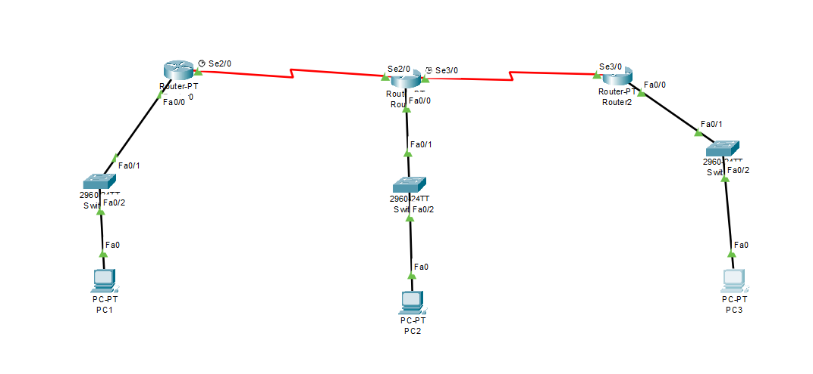
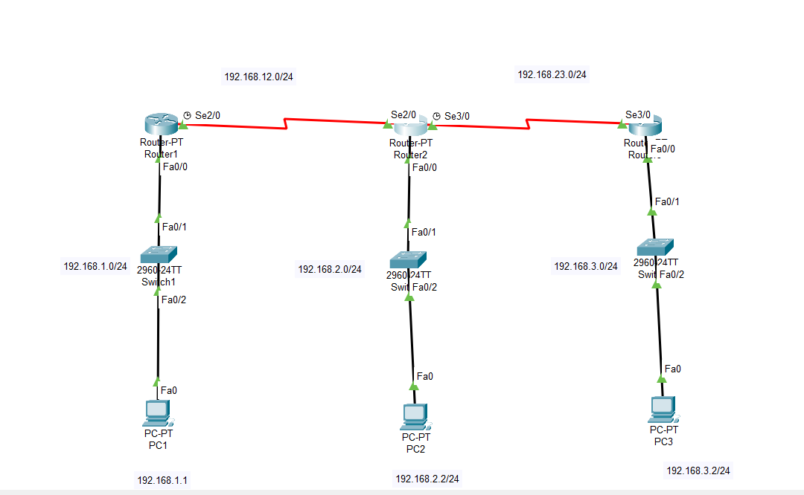
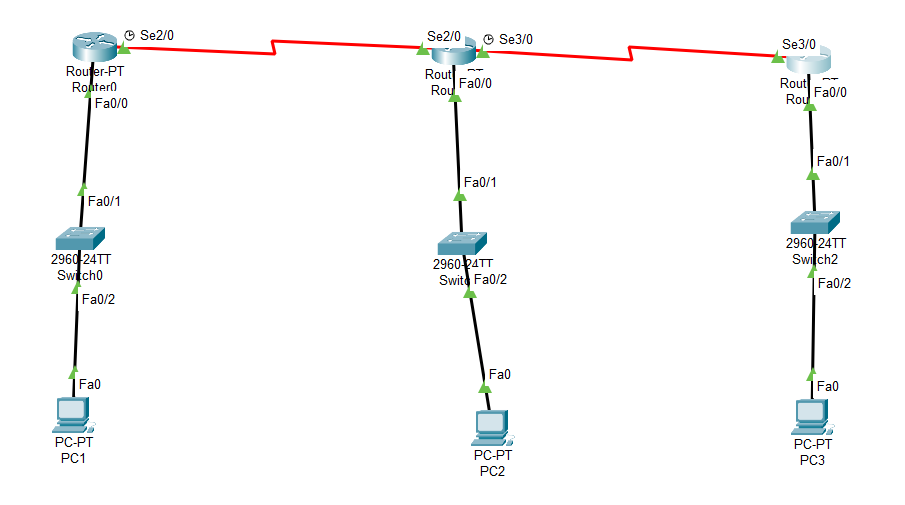
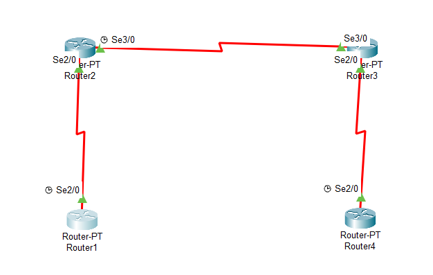
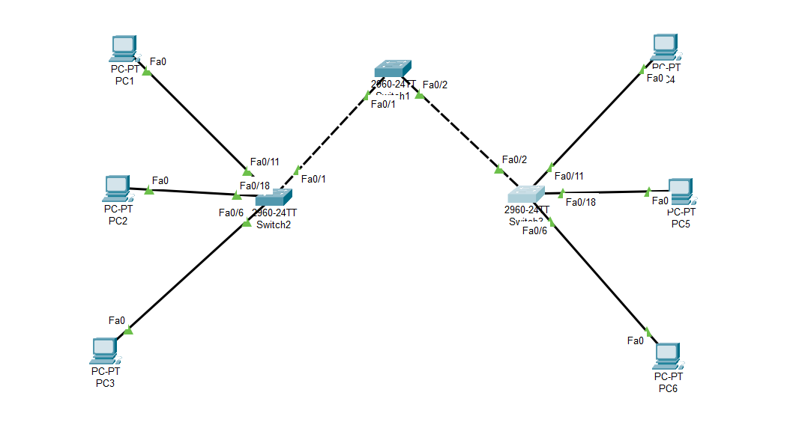
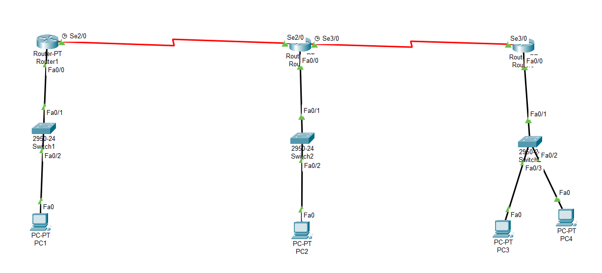

# Network_labs
## Overview

This repository contains networking laboratory exercises completed during my university coursework using **Cisco Packet Tracer**.

The labs demonstrate practical experience with routing, switching, VLAN implementation, and network security fundamentals.

---

## Technologies & Topics

- IPv4 Addressing
- Static Routing
- RIPv2
- EIGRP
- OSPF
- VLAN Configuration
- Standard ACL
- Cisco Routing
- Cisco Switching
- Cisco IOS CLI
- Cisco Packet Tracer

---

# Laboratory Exercises

---

## 01 - Static Routing

Configure static routes between multiple routers to enable communication across different networks.
ry Exercises- IPv4 Addressing
- Static Routing
- Router Configuration

### Network Topology

---

## 02 - RIPv2 Routing

Implement dynamic routing using RIPv2 to automatically exchange routing information between routers.
fundamentals- Dynamic Routing
- RIPv2
- IPv4 Addressing

### Network Topology

---

## 03 - EIGRP Routing

Configure EIGRP to provide efficient dynamic routing and automatic route advertisement.
ation, and n- EIGRP
- Dynamic Routing
- Route Advertisement

### Network Topology

---

## 04 - OSPF Routing

Deploy OSPF to establish scalable and efficient routing between multiple networks.
ntation, and- OSPF
- Dynamic Routing
- Area 0 Configuration

### Network Topology

---

## 05 - VLAN Configuration

Configure VLANs to logically separate network devices and improve network organization through access ports and trunk links.
-

## Techno- VLANs
- Access Ports
- Trunk Links
- Switch Configuration

### Network Topology

---

## 06 - Standard ACL

Implement Standard Access Control Lists (ACLs) to filter network traffic based on source IP addresses.
ntals.

---
- Standard ACL
- Traffic Filtering
- Cisco Router Security

### Network Topology

---

## Tools

- Cisco Packet Tracer
- Cisco IOS CLI

---

## Author
Sultanah Aljohani
Computer Engineering Student

Interested in Networking & Cloud Computing
