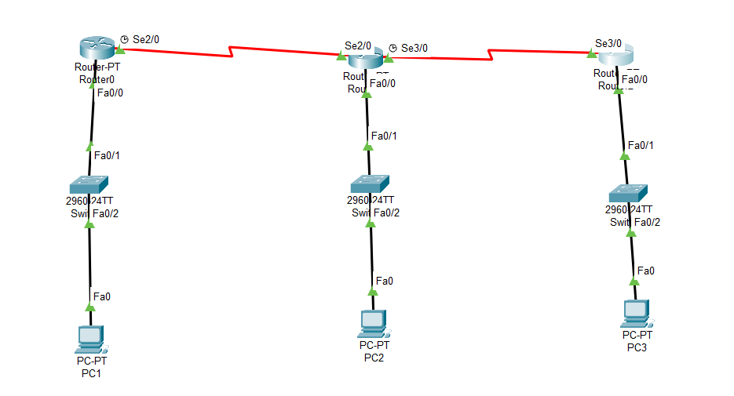

# Network_labs

This repository contains networking laboratory exercises completed during university coursework using Cisco Packet Tracer.

---

## 01 - Static Routing

### Objective
Configure a network of three routers using Static Routing to enable communication between different LANs.

### Technologies Used
- Cisco Packet Tracer
- IPv4 Addressing
- Static Routing
- Serial Connections

### Network Topology

